<p align="center">
  
</p>

<p align="center">
  <a href="mailto:spielberggao@gmail.com"></a>
  <a href="https://linkedin.com/in/spielberggao"></a>
  <a href="https://github.com/EthanReedLabs/sulde-cc-showcase"></a>
</p>

---

### `$ cat about.md`

I build full-stack products with a strong focus on mobile and frontend.

- Main direction: **audio/video multimedia** and **streaming media**
- Strong delivery surface: **Android**, **iOS**, **Flutter**, **HarmonyOS NEXT**, and frontend-facing product work
- Also comfortable building practical **AI Agent** workflows and engineering automation
- Currently building [sulde-cc showcase](https://github.com/EthanReedLabs/sulde-cc-showcase), a Claude Code workflow showcase for multi-end delivery

### `$ tree featured/`

| Path | Signal |
|---|---|
| [`featured/sulde-cc-showcase`](https://github.com/EthanReedLabs/sulde-cc-showcase) | AI Agent style workflow, 17 Claude Code skills, 11 enforcement hooks, 4-stack mobile template |
| `delivery/haidilao-smart-glasses` | Multi-end delivery across Android, iOS, Flutter, Go, and AI Agent |
| `delivery/freebeat-native` | Independent Android + iOS native delivery |
| `delivery/harmonyos-next` | Independent HarmonyOS app delivery and store release |
| `direction/audio-video-streaming` | FFmpeg, ffprobe, H.264, H.265, multimedia and streaming delivery |

### `$ ./stack --print`

<p>
  
  
  
  
  
  
  
  
  
  
  
  
  
  
</p>

### `$ tail -f current-focus.log`

```text
[active] full-stack delivery with mobile/frontend as the strongest surface
[active] audio/video multimedia and streaming media engineering
[active] practical AI Agent workflows for engineering automation
```

---

<p align="center">
  <a href="https://github.com/EthanReedLabs/sulde-cc-showcase">sulde-cc showcase</a>
  ·
  <a href="mailto:spielberggao@gmail.com">email</a>
  ·
  <a href="https://linkedin.com/in/spielberggao">linkedin</a>
</p>
